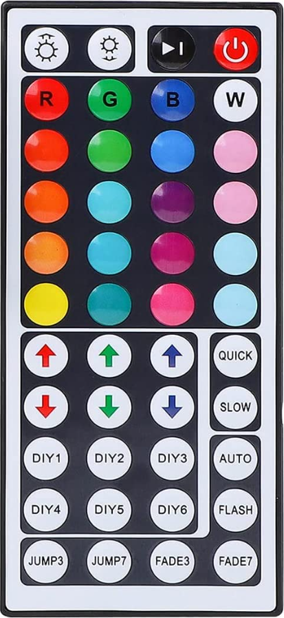

# 44-key IR remote control



Cheap 44-key infrared remote control (RGB LED strip / LED controller type) that can be used with
`IOT_LED_MATRIX_IR_REMOTE_PIN` (see `src/plugins/clock/clock_ir_receiver.cpp`).

The table below was captured by pressing the buttons from the top left to right, row by row, while the
firmware logged the received frames. It is the data of one specific remote and the **built-in default
mapping** of the firmware (see [Default button assignments](#default-button-assignments)). The firmware
only implements the NEC protocol, the buttons of any other remote can be assigned in the WebUI (see
[Configuring the remote](#configuring-the-remote)).

## Protocol

| Property | Value |
| --- | --- |
| Protocol | NEC |
| Carrier | 38 kHz |
| Address | `0x00` (`~address` = `0xFF`, constant for all buttons) |
| Frame | 32 bit, LSB first: `address`, `~address`, `command`, `~command` |
| Repeat | every ~110 ms while a button is held, contains no command byte |

The firmware prints the raw 32 bit value as it is assembled from the LSB first bit stream:

```
IR a35cff00
IR repeat
```

`IR xxxxxxxx` is a data frame, `IR repeat` is one of the repeat frames that are sent while the button
is still pressed (the counters are shown on `status.html`, see `ClockPlugin::getStatus()`).

Byte layout of the logged value - the button is identified by the **command** byte, the last two bytes are
the fixed address:

```
value   0x a3  5c  ff  00
byte       3   2   1   0
           │   │   │   └── address    0x00   (constant)
           │   │   └────── ~address   0xFF   (constant)
           │   └────────── command    0x5C   (identifies the button)
           └────────────── ~command   0xA3
```

The value that is logged can be calculated from the command byte:

```
value = (~command << 24) | (command << 16) | 0xFF00
```

and decoded back with:

```cpp
const uint8_t command = (value >> 16) & 0xff;
```

## Buttons

Rows are numbered from the top, columns from the left. Each cell contains the button label from the
remote and the NEC `command` / raw code.

| Row | Button 1 | Button 2 | Button 3 | Button 4 |
| --- | --- | --- | --- | --- |
| 1 | Brightness up (sun +)<br>`0x5C` `a35cff00` | Brightness down (sun -)<br>`0x5D` `a25dff00` | Play/Pause<br>`0x41` `be41ff00` | Power (red)<br>`0x40` `bf40ff00` |
| 2 | R (red)<br>`0x58` `a758ff00` | G (green)<br>`0x59` `a659ff00` | B (blue)<br>`0x45` `ba45ff00` | W (white)<br>`0x44` `bb44ff00` |
| 3 | Red-orange<br>`0x54` `ab54ff00` | Green<br>`0x55` `aa55ff00` | Blue<br>`0x49` `b649ff00` | Pink<br>`0x48` `b748ff00` |
| 4 | Orange<br>`0x50` `af50ff00` | Cyan<br>`0x51` `ae51ff00` | Violet<br>`0x4D` `b24dff00` | Pink<br>`0x4C` `b34cff00` |
| 5 | Orange<br>`0x1C` `e31cff00` | Turquoise<br>`0x1D` `e21dff00` | Crimson<br>`0x1E` `e11eff00` | Light blue<br>`0x1F` `e01fff00` |
| 6 | Yellow<br>`0x18` `e718ff00` | Teal<br>`0x19` `e619ff00` | Pink<br>`0x1A` `e51aff00` | Light blue<br>`0x1B` `e41bff00` |
| 7 | Up arrow (red)<br>`0x14` `eb14ff00` | Up arrow (green)<br>`0x15` `ea15ff00` | Up arrow (blue)<br>`0x16` `e916ff00` | QUICK<br>`0x17` `e817ff00` |
| 8 | Down arrow (red)<br>`0x10` `ef10ff00` | Down arrow (green)<br>`0x11` `ee11ff00` | Down arrow (blue)<br>`0x12` `ed12ff00` | SLOW<br>`0x13` `ec13ff00` |
| 9 | DIY1<br>`0x0C` `f30cff00` | DIY2<br>`0x0D` `f20dff00` | DIY3<br>`0x0E` `f10eff00` | AUTO<br>`0x0F` `f00fff00` |
| 10 | DIY4<br>`0x08` `f708ff00` | DIY5<br>`0x09` `f609ff00` | DIY6<br>`0x0A` `f50aff00` | FLASH<br>`0x0B` `f40bff00` |
| 11 | JUMP3<br>`0x04` `fb04ff00` | JUMP7<br>`0x05` `fa05ff00` | FADE3<br>`0x06` `f906ff00` | FADE7<br>`0x07` `f807ff00` |

The color buttons of rows 3-6 have no printed labels on the remote, the color names are taken from
the picture.

### Actions in the firmware

The remote is **not** hard-coded. Nothing but the NEC protocol itself is implemented in the firmware,
the buttons are assigned in the configuration (see [Configuring the remote](#configuring-the-remote)).
The 44 key remote above is the default, any other NEC remote works as well.

A repeat frame only means "the button is still held" and contains no command byte, so the decoder
reuses the last command. All actions except the brightness/color ramps ignore the repeats.

### Measurement

The codes were captured in three passes. In each pass the buttons were pressed from the top left to
the right, row by row, while the firmware logged `IR xxxxxxxx` for every data frame.

| Pass | Rows | Comment |
| --- | --- | --- |
| 1 | 1-5, 7-11 | the 4th color row (`0x18`-`0x1B`) and `DIY5` (`0x09`) were not logged |
| 2 | 1-4, 6-11 | the 3rd color row (`0x1C`-`0x1F`) was not logged |
| 3 | all 11 | complete, one data frame was logged twice (`f10eff00`) |

All three passes together cover the complete keypad, each pass is a subset of the table above and all
44 codes are unique. The command bytes confirm the assignment:

| Rows | Commands |
| --- | --- |
| 1-4 | `0x40`, `0x41`, `0x44`, `0x45`, `0x48`, `0x49`, `0x4C`, `0x4D`, `0x50`, `0x51`, `0x54`, `0x55`, `0x58`, `0x59`, `0x5C`, `0x5D` |
| 5-11 | `0x04`-`0x1F`, one block of 4 per row: `0x1C`, `0x18`, `0x14`, `0x10`, `0x0C`, `0x08`, `0x04` |

`0x00`-`0x03` are not used by this remote.

## Configuring the remote

The IR remote is configured in the WebUI: **LED Matrix → IR Remote** (`/led-matrix/irremote.html`,
the form is provided by `ClockPlugin::_createConfigureFormIRRemote()` in
`src/plugins/clock/clock_form.cpp`). The form is only available if `IOT_LED_MATRIX_IR_REMOTE_PIN` is
set for the build. (The name of the form is `irremote`, `remote` is the form of the Web Server plugin
for its remote access settings.)

By default the receiver is **enabled** and the buttons of the 44 key remote are pre-assigned (see
[Default button assignments](#default-button-assignments)), the other buttons are unassigned. To change
a button click the **Learn** button next to the field, press the button of the remote and click
**Use Code**, an empty field means "not assigned":

1. The **Learn** button (next to every code field) opens the capture dialog and disables all remote
   control actions on the device (the dialog tells the user about it). The code of the next button
   press is displayed in the dialog.
2. **Use Code** copies the code into the field, **Close** discards it. Closing the dialog always
   enables the actions again.
3. Save the configuration.

The code is also logged as `IR xxxxxxxx` (serial console) and shown on `/status.html` (LED Matrix
panel, "Last IR code"), so it can be copied manually. If the browser stops polling (tab closed or
crashed while the dialog was open), the device enables the actions again after 60 seconds.

Technically the dialog polls `/ir-remote.json?action=learn|read|stop`: `learn` disables the actions
and starts capturing, `read` returns the last code (the JSON contains `learn`, `id`, `code`,
`frames` and `repeats`) and `stop` enables them again. While capturing is active,
`ClockPlugin::_irRemoteCallbackDeferred()` only stores the code and skips all actions.

The complete 32 bit value is stored, an empty field means "not assigned". Codes are only matched
exactly, so two actions cannot share the same button.

| Group | Field | Action |
| --- | --- | --- |
| - | Enable IR Remote | turn the receiver on/off |
| Assigning Buttons | Power On/Off | turn on/off (`_setState()`, turns back on with the last brightness) |
| Assigning Buttons | Next Animation | next animation |
| Assigning Buttons | Brightness Up/Down | brightness ±6 (2%) per click, repeats ±3 (1%) while held |
| Assigning Buttons | Color Step Per Press | level change of the Red/Green/Blue Up/Down buttons (1-127, default 8) |
| Assigning Buttons | Red/Green/Blue Up/Down | change the level of one color channel, a held button ramps |
| Color Buttons 1-5 | Button n Code | set the color of "Button n Color" |
| Color Buttons 1-5 | Button n Color | color value of the button (e.g. `#ff0000` or a color name) |
| all code fields | Learn | capture the code of a button press (see above) |

The 20 color buttons are grouped in 5 blocks of 4 to keep the page small, the layout matches the
5x4 color keypad of the example remote. The color actions only change the color (`setColorAndRefresh()`),
the running animation is kept - identically to the color picker in the WebUI. The color is stored in the
color of the current animation (`flashing_color`, `visualizer.color`, otherwise `solid_color`, see
`ClockPlugin::_getColorVar()`), animations without color support (e.g. `Rainbow`) are not affected. The
brightness steps are the same that the physical buttons use (see `ClockPlugin::_buttonCallbackQueued()`).

The actions themselves are implemented in `ClockPlugin::_irRemoteActionQueued()`
(`src/plugins/clock/clock_ir_receiver.cpp`) and are driven by
`KFCConfigurationClasses::Plugins::ClockConfigNS::IRRemoteConfigType::ActionType`.

### Default button assignments

The built-in defaults (`IRRemoteConfigType::applyDefaults()`) map the 44 key remote. All of them can be
changed or cleared in the IR Remote form:

| Button | Code | Action |
| --- | --- | --- |
| Power | `bf40ff00` | Power On/Off |
| Play/Pause | `be41ff00` | Next Animation |
| Brightness up | `a35cff00` | Brightness Up |
| Brightness down | `a25dff00` | Brightness Down |
| R | `a758ff00` | Color Button 1, `#ff0000` |
| G | `a659ff00` | Color Button 2, `#00ff00` |
| B | `ba45ff00` | Color Button 3, `#0000ff` |
| W | `bb44ff00` | Color Button 4, `#ffffff` |
| Up arrow (red) | `eb14ff00` | Red Up |
| Down arrow (red) | `ef10ff00` | Red Down |
| Up arrow (green) | `ea15ff00` | Green Up |
| Down arrow (green) | `ee11ff00` | Green Down |
| Up arrow (blue) | `e916ff00` | Blue Up |
| Down arrow (blue) | `ed12ff00` | Blue Down |

The remaining color buttons of rows 3-6 can be assigned to the other 16 color buttons, the
color names of the table above can be used as a hint for `Button n Color`. The defaults are applied when
the stored configuration is empty (new device or after a factory reset).

## Re-measuring

1. Flash a build with `IOT_LED_MATRIX_IR_REMOTE_PIN` set (see `[env:wled_esp32_controller]`,
   IR receiver on GPIO 4) and open the serial console.
2. Use the **Learn** button of the WebUI (see above) or press the buttons from the top left to right,
   row by row.
3. Each data frame is printed as `IR xxxxxxxx`, `IR repeat` while a button is held.
   Row breaks can be added to the log by pressing enter in the terminal.
4. The counters and the last code are also visible on `/status.html` (LED Matrix panel).
